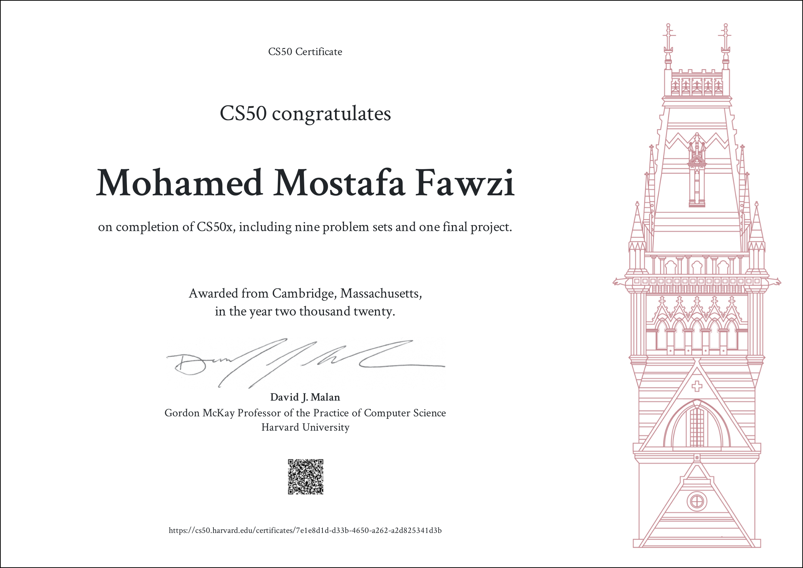

# Harvard CS50 - CS Class
This is CS50 CS Class, Harvard University's introduction to the intellectual enterprises of computer science and the art of programming.

## [Week 00: Scratch 😺](https://cs50.harvard.edu/x/2020/weeks/0/)
* [Problem Set 00](https://cs50.harvard.edu/x/2020/psets/0/)
- [x] [Problem Set 00 Solutions](./pset0)

## [Week 01: C](https://cs50.harvard.edu/x/2020/weeks/1/)
* [Problem Set 01](https://cs50.harvard.edu/x/2020/psets/1/)
- [x] [Problem Set 01 Solutions](./pset1)

## [Week 02: Arrays](https://cs50.harvard.edu/x/2020/weeks/2/)
* [Problem Set 02](https://cs50.harvard.edu/x/2020/psets/2/)
- [x] [Problem Set 02 Solutions](./pset2)

## [Week 03: Algorithms](https://cs50.harvard.edu/x/2020/weeks/3/)      
* [Problem Set 03](https://cs50.harvard.edu/x/2020/psets/3/)
- [x] [Problem Set 03 Solutions](./pset3)

## [Week 04: Memory](https://cs50.harvard.edu/x/2020/weeks/4/)     
* [Problem Set 04](https://cs50.harvard.edu/x/2020/psets/4/)
- [x] [Problem Set 04 Solutions](./pset4)

## [Week 05: Data Structures](https://cs50.harvard.edu/x/2020/weeks/5/)      
* [Problem Set 05](https://cs50.harvard.edu/x/2020/psets/5/)
- [x] [Problem Set 05 Solutions](./pset5)

## [Week 06: Python 🐍](https://cs50.harvard.edu/x/2020/weeks/6/)     
* [Problem Set 06](https://cs50.harvard.edu/x/2020/psets/6/)
- [x] [Problem Set 06 Solutions](./pset6)

## [Week 07: SQL](https://cs50.harvard.edu/x/2020/weeks/7/)     
* [Problem Set 07](https://cs50.harvard.edu/x/2020/psets/7/)
- [x] [Problem Set 07 Solutions](./pset7)

## [Week 08: Information](https://cs50.harvard.edu/x/2020/weeks/8/)           

## Certificate

##
[Harvard CS50 - CS Class](https://cs50.harvard.edu/x/2020/)
